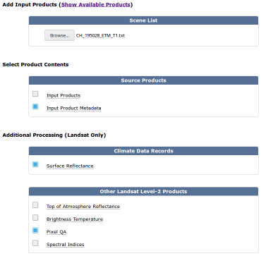
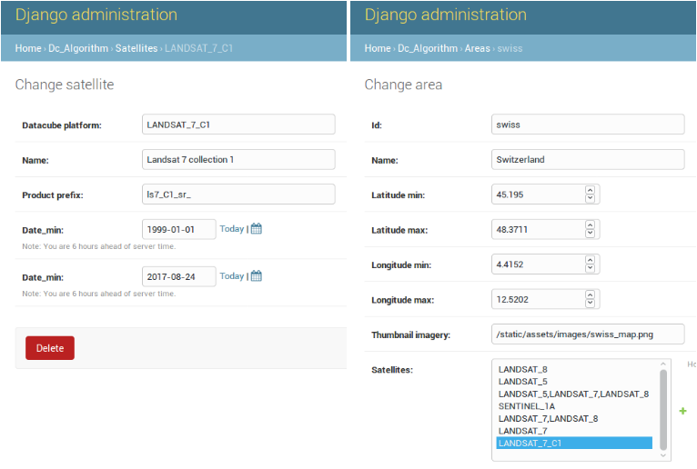

# Create and ingest a new product (e.g. Landsat 7 SR from USGS)
* Order SR scenes from (https://espa.cr.usgs.gov)



* Download scenes faster using Firefox plugin DownThemAll

* Adapt and place *ls7_C1_sr_scene.yaml* in */home/sdcuser/Datacube/agdc-v2/ingest/dataset_types*
```yaml
name: ls7_C1_sr_scene
description: Landsat 7 USGS Collection 1 Higher Level SR scene processed using LEDAPS. 30m UTM based projection.
metadata_type: eo

metadata:
    platform:
        code: LANDSAT_7_C1
```
* Adapt and place *ls7_C1_sr_switzerland.yaml* in */home/sdcuser/Datacube/agdc-v2/ingest/ingestion_configs*
```yaml
source_type: ls7_C1_sr_scene
output_type: ls7_C1_sr_swiss

description: Landsat 7 USGS Collection 1 Higher Level SR scene processed using LEDAPS. Resampled to 30m EPSG:4326 projection with a sub degree tile size.

location: '/datacube/ingested_data'
file_path_template: 'LS7_ETM_C1/General/LS7_ETM_C1_4326_{tile_index[0]}_{tile_index[1]}_{start_time}.nc'
global_attributes:
  title: CEOS Data Cube Landsat Surface Reflectance
  summary: Landsat 7 Enhanced Thematic Mapper Plus ARD prepared by NASA on behalf of CEOS.
  source: LEDAPS surface reflectance product prepared using USGS Collection 1 data.
  institution: CEOS
  instrument: ETM
  cdm_data_type: Grid
  keywords: AU/GA,NASA/GSFC/SED/ESD/LANDSAT,REFLECTANCE,ETM+,TM,OLI,EARTH SCIENCE
  keywords_vocabulary: GCMD
  platform: LANDSAT_7_C1
  processing_level: L2
  product_version: '2.0.0'
  product_suite: USGS Landsat Collection 1
  project: CEOS
  coverage_content_type: physicalMeasurement
  references: http://dx.doi.org/10.3334/ORNLDAAC/1146
  license: https://creativecommons.org/licenses/by/4.0/
  naming_authority: gov.usgs
  acknowledgment: Landsat data is provided by the United States Geological Survey (USGS).

ingestion_bounds: # Specified in Storage CRS coordinates. Will expand to tile boundaries.
  left: 4.4
  bottom: 45.12
  right: 12.53
  top: 48.4

storage:
  driver: NetCDF CF

  crs: EPSG:4326
  tile_size:
          longitude: 0.949592
          latitude: 0.949592
  resolution:
          longitude: 0.000271312
          latitude: -0.000271312
```
* Adapt and place *usgs_ls_ard_C1_prepare.py* in *.../agdc-v2/ingest/prepare_scripts*
```python
        'platform': {
            'code': fields["satellite"] + '_C1'
        },
```
* Transfer downloaded *tar.gz* to */datacube/scenes*
* Unzip them to */datacube/original_data*
* Then via ssh:
```
cd ~/Datacube/agdc-v2
source ~/Datacube/datacube_env/bin/activate
datacube product add ingest/dataset_types/ls7_C1_sr_scene.yaml
python /home/sdcuser/Datacube/agdc-v2/ingest/prepare_scripts/usgs_ls_ard_C1_prepare.py /datacube/original_data/*
datacube dataset add /datacube/original_data/*/*.yaml --auto-match
datacube -v ingest -c /home/sdcuser/Datacube/agdc-v2/ingest/ingestion_configs/ls7_C1_sr_switzerland.yaml
deactivate
```
* Add your product in the datacube using the admin section


